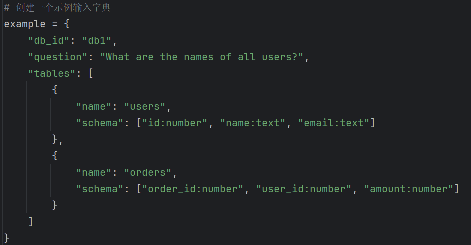
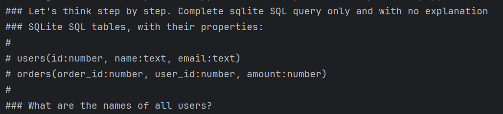
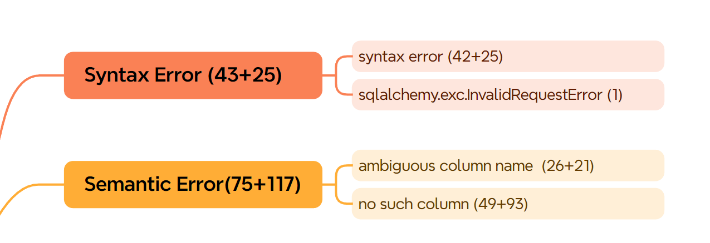

### links
* DAIL-SQL：[[2308.15363] Text-to-SQL Empowered by Large Language Models: A Benchmark Evaluation](https://arxiv.org/abs/2308.15363)
* DAIL-SQL论文解读：[【论文阅读】《Text-to-SQL Empowered by Large Language Models: A Benchmark Evaluation》-CSDN博客](https://blog.csdn.net/weixin_45606499/article/details/133905621)
* DAIL-SQL code：[BeachWang/DAIL-SQL: A efficient and effective few-shot NL2SQL method on GPT-4.](https://github.com/BeachWang/DAIL-SQL)

### setup

#### 环境
见github项目中的requirements.txt

#### spider_data数据集下载
[Spider1.0_数据集说明](../Spider1.0/Spider1.0_数据集说明.md)

#### gpt-3.5-turbo_2.0
1. 测试数据取自`spider_data`中的测试文件test.json 的2147条,  对应的database schema文件test_tables.json以及test_gold.sql
2. input : Spider1.0数据集的测试文件 ,  以及对应的database schema文件tables.json
3. output : 生成的sql文件 "predict.txt" ，llm的生成结果和代价的记录文件predict.jsonl
4. llm setup 
* model = "gpt-3.5-turbo"
* temperature = 0.0
* 测试数目：2147条

#### gpt-3.5-turbo_3.0
1. 测试数据取自`spider_data`中的测试文件train_spider.json 的3000条,  对应的database schema文件train_tables.json以及train_gold.sql
2. input : Spider1.0数据集的测试文件 ,  以及对应的database schema文件tables.json
3. output : 生成的sql文件 "predict.txt" ，llm的生成结果和代价的记录文件predict.jsonl
4. llm setup 
* model = "gpt-3.5-turbo"
* temperature = 0.0
* 测试数目：3000条
#### ~~glm-4-plus_2.0~~
1. 测试数据取自`spider_data`中的测试文件test.json 的2147条,  对应的database schema文件test_tables.json以及test_gold.sql（外加train.json的3000条）
2. input : Spider1.0数据集的测试文件 ,  以及对应的database schema文件tables.json
3. output : 生成的sql文件 "predict.txt" ，llm的生成结果和代价的记录文件predict.jsonl
4. llm setup 
* model = “glm-4-plus"
* temperature = 0.0
* 测试数目：5000条

#### ~~Deepseek~~
* 不想花自己的钱，所以暂且搁置


### prompt构造
以DAIL-SQL论文的prompt模板组织本实验的prompt（其中**Basic Prompt**和**OpenAI Demostration Prompt**效果较好，此处选**OpenAI Demostration Prompt**，详见本文开头的links）。
**OpenAI Demostration Prompt** 的模板如下：

prompt的具体代码实现流程如下：
1. 提取spider所有database的对应table schema
	* 文件：process_database_schema.py
	* 函数：process_tables_definition_json(file:str)
	* 输入：spider的各类tables definition文件
	* 输出：为每个database提取下面格式的table schema，存储到spider_data/database和spider_data/test_database两个文件夹下面的对应子文件夹中，命名为schema.json。
	``` json
	[  
	    {  
	        "name": "users",  
	        "schema": ["id:number", "name:text", "email:text"]  
	    },  
	    {  
	        "name": "orders",  
	        "schema": ["order_id:number", "user_id:number", "amount:number"]  
	    }  
	]
    ```

2. 将各个变量嵌入到DAIL-SQL的OpenAI Demostration Prompt模板中（这部分代码摘抄自DAIL-SQL的PromptReprTemplate.py文件）
	* 文件：PromptReprTemplate.py
	* 函数：class NumberSignCOTPrompt(BasicPrompt)的def format_target(self, example: dict)
	* 输入：example 字典包含了查询相关的信息，比如question,数据库表的结构、问题等（也就是spider的json格式单条测试数据+前面第一步得到的table schema）。如下图所示：
	* 输入格式：
	* 输出：得到格式化的prompt，如下图所示。
	* 输出格式：


### run llm agent
下面分别是实验设置gpt-3.5-turbo_2.0，glm-4-plus_2.0执行text-to-sql的指令
``` shell
cd <project_directory>
```

gpt-3.5-turbo_2.0：
``` shell
python -m Spider1_LLM_Baseline.chatgpt_text_to_sql --gold_input_json "spider_data/test.json" --gold_tables_json "spider_data/test_tables.json" --test_num 1000 --model "gpt-3.5-turbo" --exp_id "2.0" --temperature 0.0 --llm_key ${your_api_key}
```

gpt-3.5-turbo_3.0：

``` shell
python -m Spider1_LLM_Baseline.chatgpt_text_to_sql --gold_input_json "spider_data/train_spider.json" --gold_tables_json "spider_data/test_tables.json" --test_num 1000 --model "gpt-3.5-turbo" --exp_id "3.0" --temperature 0.0 --llm_key ${your_api_key}
```

glm-4-plus_2.0:
``` shell
python -m Spider1_LLM_Baseline.zhipu_text_to_sql --gold_input_json "spider_data/test.json" --gold_tables_json "spider_data/test_tables.json" --test_num 1000 --model "glm-4-plus" --exp_id "2.0" --temperature 0.0 --llm_key ${your_api_key}
```

上述指令参数说明：

| option               | description                       |
| -------------------- | --------------------------------- |
| `--gold_input_json`  | spider的测试用例的json格式文件              |
| `--gold_tables_json` | spider的相关tables schema信息的json格式文件 |
| `--test_num`         | 从spider_data的测试数据集中选取的测试数据条数      |
| `--temperature`      | Temperature for LLM               |
| `--model`            | Model to use for LLM              |
| `--exp_id`           | 本次实验的id标识                         |
| `--llm_key`          | llm key                           |

运行结果将输出到文件夹`Output`的`model_name`子文件夹中，如下：
* gold.txt : 指定测试个数的sqls正确答案
* predict.txt : 指定测试个数的sqls预测答案
* predict.jsonl ：指定测试个数的text-to-sql任务中间结果
* detailed_gold_info.jsonl：顺便整理出所有的测试用例的详细信息

### evaluate

#### 评估信息
评估时，需要处理得到下面两部分信息。
* 测试用例基本信息
	* db_id：数据库名称
	* tables：table schema(表格基本信息，包括类型，列名等等)
	* question：问题
	* query：标准答案sql
* 测试用例结果
	* predict：llm回答sql
	* gold_exec_result：标准答案query的执行结果，执行时间，错误信息，可执行标记。（格式为字典{"result":str, "exec_time":float, "error_message": null或者str , "exec_able": bool}）
	* predict_exec_result：predict的执行结果，结构同gold_exec_result
	* exec_acc：predict执行结果是否与标准答案一致，一致则为true

**注意：exec_able为false的predict值为语法错误，不可执行；exec_acc为false的predict值为语法和语义错误，不可执行或执行结果不匹配。**


#### 评估所用数据库sqlite
* 原spider的评估框架给定sqlite连接方式不能返回错误信息，这边换成我们前面使用过的连接方式
#### 评估指令
下面分别是实验设置gpt-3.5-turbo_2.0，glm-4-plus_2.0执行评估的指令
``` shell
cd <project_directory>
```

gpt-3.5-turbo_2.0：
``` shell
python evaluation.py --model "gpt-3.5-turbo" --exp_id "2.0" --gold "Output/gpt-3.5-turbo_2.0/gold.txt" --pred "Output/gpt-3.5-turbo_2.0/predict.txt" --acc "Output/gpt-3.5-turbo_2.0/eval_result.txt" --db "spider_data/test_database" --etype "all" --table "spider_data/test_tables.json"
```
gpt-3.5-turbo_3.0：
``` shell
python evaluation.py --model "gpt-3.5-turbo" --exp_id "3.0" --gold "Output/gpt-3.5-turbo_3.0/gold.txt" --pred "Output/gpt-3.5-turbo_3.0/predict.txt" --acc "Output/gpt-3.5-turbo_3.0/eval_result.txt" --db "spider_data/test_database" --etype "all" --table "spider_data/test_tables.json"
```

glm-4-plus_2.0:
``` shell
python evaluation.py --model "glm-4-plus" --exp_id "2.0" --gold "Output/glm-4-plus_2.0/gold.txt" --pred "Output/glm-4-plus_2.0/predict.txt" --acc "Output/glm-4-plus_2.0/eval_result.txt" --db "spider_data/test_database" --etype "all" --table "spider_data/test_tables.json"
```

上述指令的输出结果存储于文件夹`Output`的`model_name`子文件夹中，如下：
* eval_result.txt : 指定测试个数的sqls的text-to-sql任务评估结果
* merged_info.jsonl：上面的评估信息的汇总，格式见本节的”评估信息“

### results
见eval_result.txt文件

下面是类型统计：
* SyntaxErrorPercent:0.013211579560909268(68/5147)
* SemanticErrorPercent:0.03769185933553526(194/5147)
* LogicErrorPercent:0.21021954536623275(1082/5147)

* SyntaxError
```json
{  
  "sqlalchemy.exc.InvalidRequestError:A value is required for bind parameter 'text'": 1,
  "syntax error" : 67
}  
```

* SemanticError
```json
{  
  "ambiguous column name": 47,  
  "no such column": 142,  
  "wrong number of arguments to function COUNT()": 2,  
  "incomplete input": 1,  
  "misuse of aggregate function AVG()": 2  
}
```

